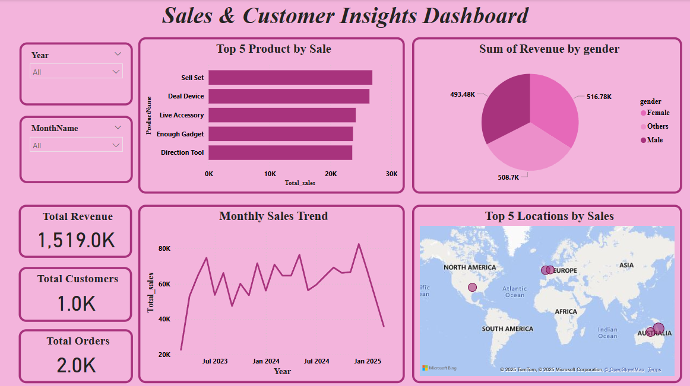

# Sales & Customer Insights Dashboard

## Project Overview
The **Sales & Customer Insights Dashboard** is a comprehensive **business intelligence solution** that provides valuable insights into **sales performance and customer behavior**. This project integrates **MySQL** for efficient data storage and transformation with **Power BI** for visualization and reporting.

By analyzing **sales trends, customer demographics, and product performance**, businesses can make **data-driven decisions** to optimize revenue and enhance customer engagement.

---

## Key Objectives
- Track **sales performance** across different time periods.  
- Identify **top-selling products** and revenue contributors.  
- Analyze **customer demographics** based on location, age, and gender.  
- Monitor **monthly sales trends** for business forecasting.  
- Enable **interactive reporting** using Power BI dashboards.  

---

## Project Workflow

### 1. MySQL Database Setup
The project is powered by a **relational database** in **MySQL**, which stores **sales transactions, product details, and customer information**. The database is designed to efficiently **handle large datasets** while ensuring **data integrity** through well-defined relationships.

### 2️. Data Analysis Using SQL
To gain insights from raw sales data, **optimized SQL queries** are used to extract key metrics, including:

- **Total Sales & Revenue** – Calculates the total revenue generated from all sales.  
- **Top-Selling Products** – Identifies the most popular products based on quantity sold.  
- **Monthly Sales Trends** – Tracks revenue fluctuations over different months.  
- **Customer Segmentation** – Analyzes revenue distribution by gender and location.  

### 3️. Connecting MySQL to Power BI
To create a **dynamic reporting system**, the MySQL database is **connected to Power BI** using the **ODBC driver**. The data is transformed and modeled in Power BI to establish relationships between tables and enable interactive analysis.

### 4️. Building the Power BI Dashboard
The **Power BI Dashboard.pbix** file includes **visually rich reports** that present actionable insights. The dashboard consists of:

- **KPI Cards** – Displays total revenue, total customers, and total orders.  
- **Bar Chart** – Highlights the top 5 products by sales volume.  
- **Line Chart** – Shows monthly sales trends over time.  
- **Pie Chart** – Represents revenue distribution by customer gender.  
- **Geo Map** – Displays sales by customer location.  

### 5. Interactive Features
To enhance usability, the dashboard includes:  
- **Date Filters** – Allows users to filter data by year and month.

---

## Business Value
- **Improved Decision Making** – Helps stakeholders understand sales patterns and customer preferences.  
- **Sales Optimization** – Identifies high-performing products and underperforming categories.  
- **Customer Insights** – Provides demographic analysis to tailor marketing strategies.  
- **Scalability** – The database and dashboard design can accommodate **growing data volumes**.  

---

## Dashboard created for analysis

### Using Power BI: [Dashboard](Dashboard.pbix)

### SQL Programs:
- [Database Schema & Data Setup](Sales&Customer_data.sql)
- [SQL Queries for Data Analysis](Analysis.sql)

---

## Conclusion
This project provides an **end-to-end data analytics solution** for tracking **sales and customer insights**. By leveraging **MySQL for structured data storage** and **Power BI for interactive reporting**, businesses can enhance their **data-driven strategies** for sustainable growth.  

